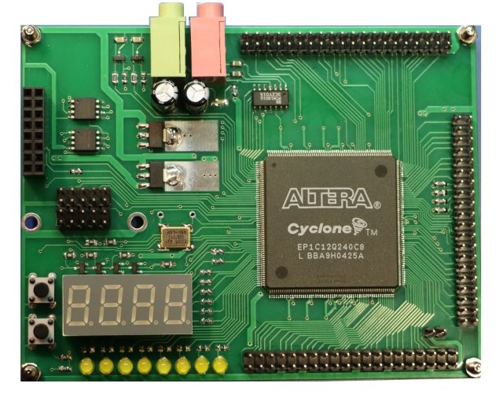

# MCY112 FPGA board

Плата MCY112 простая, но вполне подходит для изучения возможностей ПЛИС. На этой плате мы и светодиодами поморгать сможем и систему на кристалле с процессором RISC-V запустим.

Рассмотрим плату подробнее. В ПЛИС EP1C12Q240C8 содержатся 12060 логических элементов, 239616 бит встроенной памяти, два PLL. На плате установлены:

- Кварцевый генератор 100Мгц;
- Две пользовательские кнопки;
- Восемь пользовательских светодиодов и 7-ми сегментный индикатор;
- SDRAM IS42S32200B, 8 (или 16) Мбайт, 32 разряда шина данных (на обратной стороне платы);
- Двухканальная аудио АЦП PCM1801U,16 бит, 48 Кгц;
- Двухканальный аудио выход для Дельта Сигма ЦАП (8бит);
- Три разъема для установки плат расширения, квазисовместимые с Raspberry Pi;
- SPI Flash W25Q16, 2 Мбайта для автозагрузки ПЛИС:
- SPI Flash W25Q16, 2 Мбайта для пользовательских данных;
- Разъем для установки USB JTAG программатора, например MBFTDI или UsbBlaster
- Разъем Active Serial для прошивки флэш памяти автозагрузки ПЛИС тем же самым программатором MBFTDI или UsbBlaster.

Подробное описание платы https://marsohod.org/howtostart/mcy112
