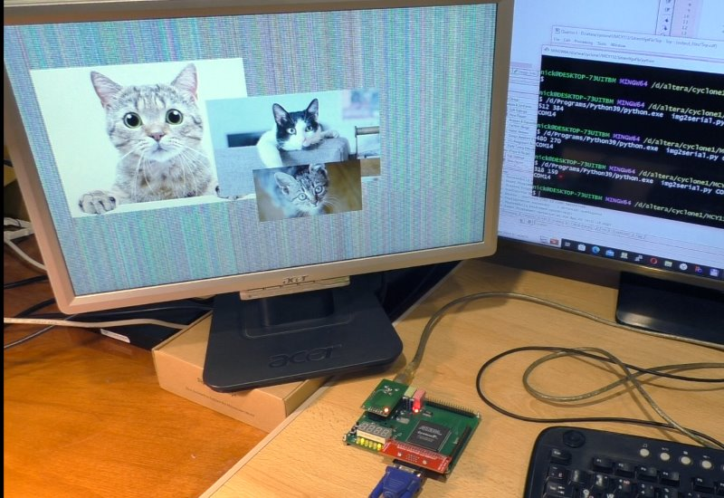

# MCY112 видеофреймбуффер

На плату MCY112 может устанавливается платка VGA от Raspberry Pi.
Вот так:

К VGA разъему платы подключается монитор.

Этот FPGA проект реализует видео фреймбуффер из SDRAM платы MCY112.
Откомпилируйте проект в среде Altera Quartus Web Edition 9.1 и загрузите в ПЛИС платы.

На экране монитора появится изображение случайных пикселей памяти SDRAM, матрасик.
Теперь с помощью скрипта на питоне можно через последовательный порт платы загрузить изображение во фреймбуффер:

>python img2serial COM22 cat5.jpg 100 200

На экране монитора будет картинка:

Описание проекта для платы MCY112:
https://marsohod.org/projects/mcy112-prj/429-vga-framebuffer-mcy112

